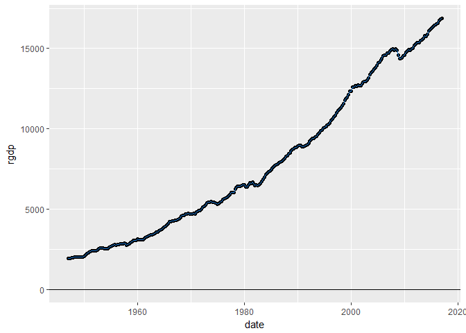
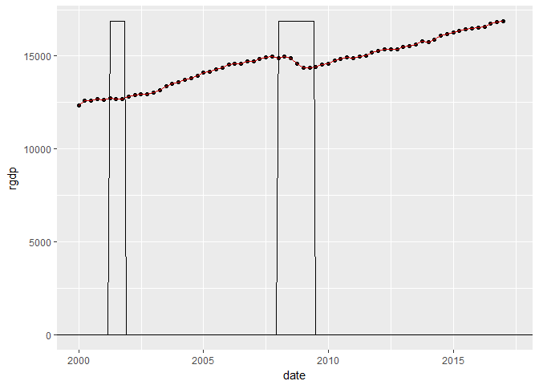

<!-- README.md is generated from README.Rmd. Please edit that file -->
    ## Loading tidyverse: ggplot2
    ## Loading tidyverse: tibble
    ## Loading tidyverse: tidyr
    ## Loading tidyverse: readr
    ## Loading tidyverse: purrr
    ## Loading tidyverse: dplyr

    ## Conflicts with tidy packages ----------------------------------------------

    ## filter(): dplyr, stats
    ## lag():    dplyr, stats

AdvancedR
=========

The goal of Macroeconomic functions is to extract macroeconomic time series data quickly and efficiently. If desired the extracted time series data can be expanded to include columns of growth rates. In addition, when presenting macroeconomic times series data the points in the data where a recession occurred is often informative. This package includes a function used to extract US recession dates and prepare them for presentation with other macroeconomic data.

Example
-------

Currently this package will extract the following four time series, Real GDP (RGDP), Consumer Price Index (CPI), the unemployment rate (unemploymentrate), and the US population (population), using the ME\_dtaextract() function For example to extract the macroeconomic time series for real gross domestic product:

``` r
X<-ME_dtaextract("rgdp")
kable(head(X))
```

| date       |    rgdp| units    |
|:-----------|-------:|:---------|
| 1947-01-01 |  1934.5| millions |
| 1947-04-01 |  1932.3| millions |
| 1947-07-01 |  1930.3| millions |
| 1947-10-01 |  1960.7| millions |
| 1948-01-01 |  1989.5| millions |
| 1948-04-01 |  2021.9| millions |

The data in this table is in levels; i.e. for each date in the table we're given the level of real GDP. The data in this table can easily be rendered in a graphical form.

``` r
X %>% ggplot(aes(x=date, y=rgdp))+
        geom_point()+
        geom_line(color="dodgerblue3")+
        geom_hline(yintercept=0)
```



In many circumstances the data given in levels is more interesting if it is transformed to growth rates. This is especially true of macroeconomic data. For example, transforming the CPI data into growth rates creates a data series representing rates of inflation. For example, converting real gross domestic product to growth rates in real GDP is done quickly using the code below.

``` r
X<-X %>% ME_growth()
kable(head(X))
```

| date       |    rgdp| units    |      Growth| Measure   |  Annual\_Growth| Measured |
|:-----------|-------:|:---------|-----------:|:----------|---------------:|:---------|
| 1947-04-01 |  1932.3| millions |  -0.0011372| Quarterly |      -0.0045490| Annual   |
| 1947-07-01 |  1930.3| millions |  -0.0010350| Quarterly |      -0.0041401| Annual   |
| 1947-10-01 |  1960.7| millions |   0.0157488| Quarterly |       0.0629954| Annual   |
| 1948-01-01 |  1989.5| millions |   0.0146886| Quarterly |       0.0587545| Annual   |
| 1948-04-01 |  2021.9| millions |   0.0162855| Quarterly |       0.0651420| Annual   |
| 1948-07-01 |  2033.2| millions |   0.0055888| Quarterly |       0.0223552| Annual   |

The length of the data series can be manipulated by way of the date variable; e.g., maybe only real GDP data since 2000 is of interest. We can reduce the scope of the data with another call to the ME\_growth function, as shown here.

``` r
X1<-ME_growth(X,"2000-01-01")
kable(head(X1))
```

| date       |     rgdp| units    |      Growth| Measure   |  Annual\_Growth| Measured |
|:-----------|--------:|:---------|-----------:|:----------|---------------:|:---------|
| 2000-01-01 |  12359.1| millions |   0.0029051| Quarterly |       0.0116203| Annual   |
| 2000-04-01 |  12592.5| millions |   0.0188849| Quarterly |       0.0755395| Annual   |
| 2000-07-01 |  12607.7| millions |   0.0012071| Quarterly |       0.0048283| Annual   |
| 2000-10-01 |  12679.3| millions |   0.0056791| Quarterly |       0.0227163| Annual   |
| 2001-01-01 |  12643.3| millions |  -0.0028393| Quarterly |      -0.0113571| Annual   |
| 2001-04-01 |  12710.3| millions |   0.0052992| Quarterly |       0.0211970| Annual   |

Finally, most macroeconomic data, when presented in a classroom/report setting, include markers showing where in time recessions occurred. This data is collected by the national bureau of economic research (NBER) and deposited at the St. Louis FED. This data is extracted and prepared for graphing use the ME\_Rec function as shown here.

``` r
rec<-ME_Rec(X1)
kable(head(rec))
```

| date       |  recession| units |  Cyc|
|:-----------|----------:|:------|----:|
| 2000-01-01 |          0| unit  |    0|
| 2000-02-01 |          0| unit  |    0|
| 2000-03-01 |          0| unit  |    0|
| 2000-04-01 |          0| unit  |    0|
| 2000-05-01 |          0| unit  |    0|
| 2000-06-01 |          0| unit  |    0|

With the data trimmed to 2000 we can use the recession data to place recession markers in the picture showing real GDP series.

``` r
X1%>%ggplot(aes(x=date, y=rgdp))+
        geom_point()+
        geom_line(color="red3")+
        geom_path(data=rec, aes(x=date, y=Cyc))+
        geom_hline(yintercept = 0)
```



The Federal Reserve Bank of St. Louis maintains thousands of economic time series all are available to the public. However, at this time ME\_dtaextract function will only extract the four series stated above. The functions ME\_growth and ME\_Rec will work with any of the FEDS time series data.
